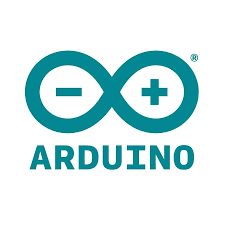

## Code Card Arduino


The Code Card runs on an [ESP8266](https://en.wikipedia.org/wiki/ESP8266) Wi-fi microcontroller.  

The ESP8266 is a low-cost Wi-Fi microchip with full TCP/IP stack and microcontroller capability produced by manufacturer Espressif Systems. The processor is an L106 32-bit RISC microprocessor core running at 80 MHz, with 4 MiB external QSPI flash. The ESP8266 supports IEEE 802.11 b/g/n Wi-Fi, WEP or WPA/WPA2 authentication, and also open networks.  

We have included the source code so you can modify you Code Card however you want!  

### Software
You need to download the [Arduino IDE](https://www.arduino.cc/en/Main/Software) and configure to use the Arduino core for ESP8266 WiFi chip.  
The Arduino core for ESP8266 is a C++ based firmware. With this core, the ESP8266 CPU and its Wi-Fi components can be programmed like any other Arduino device using the Arduino IDE.  

### Code Card Source Code
Download or `git clone https://github.com/cameronsenese/codecard.git` this project and open the Arduino main file ([codecard.ino](https://github.com/noelportugal/codecard/blob/master/arduino/codecard/codecard.ino)) to get started.

- /arduino contains the source code for the Code Card
- /arduino/bin contains a precompiled image of the Code Card firmware

## Instructions
The following instruction describes the setup and configuration of the Arduino IDE, and the process to upload firmware to the Code Card using the Arduino IDE:

1. Install the Arduino IDE version 1.8.8: https://www.arduino.cc/en/Main/Software
2. Install the serial driver for the ESP-12F Wi-Fi chip: https://www.silabs.com/products/development-tools/software/usb-to-uart-bridge-vcp-drivers
3. Clone the `codecard` GitHub repository to obtaon the source code: https://github.com/cameronsenese/codecard
4. In the Arduino IDE, go to Preferences and set the “Additional Board Managers URLs to http://arduino.esp8266.com/stable/package_esp8266com_index.json
5. Install esp8266 support: Tools | Board | Board Manager
   - esp8266 by ESP8266 Community 2.4.2
6. Install the required modules: Sketch | Include Libraries | Manage Libraries
   - ArduinoJson by Benoit Blanchon version 5.13.3
   - GxEPD2 by Jean-Marc Zingg version 1.1.0
   - Adafruit GFX Library by Adafruit 1.4.8
7. Under Tools set the following settings:
   - Board: “Generic ESP8266 Module”
   - Upload Speed “115200”
   - CPU Frequency: “80 MHz”
   - Crystal Frequency: “26 MHz”
   - Flash Size: “4M (3M SPIFFS)”
   - Flash Mode: “DIO”
   - Flash Frequency: “40MHz”
   - Reset Method: “nodemcu”
   - Debug port: “Disabled”
   - Debug Level: “None”
   - IwIP Variant: “v2 Lower Memory”
   - VTables: “Flash”
   - Builtin Led: “2”
   - Erase Flash: “Only Sketch”
   - Port: This is the port that shows up once you turn on the CodeCard and press a button
   - Programmer: “ArduinoISP”
8.  Open the codecard.ino sketch located in the /arduino directory downloaded in step 3 above
   - File | Open | codecard.ino
11. Connect the CodeCard via USB to your computer
12. Establish serial connection via Arduino IDE:
   - Tools | Serial Monitor
11. Turn on the Code Card
12. Press and hold button `A` for 10 seconds after the following output:
```
Shuting down...
Shuting down...
```
13. From the Arduino IDE choose Sketch | Upload
    - The Arduino IDE may compile the skectch before uploading to the Code Card.
    - The following output indicates completed firmware upload:
```
Sketch uses 447692 bytes (89%) of program storage space. Maximum is 499696 bytes.
Global variables use 43260 bytes (52%) of dynamic memory, leaving 38660 bytes for local variables. Maximum is 81920 bytes.
Uploading 451840 bytes from ...\arduino_build_548415/codecard.ino.bin to flash at 0x00000000
................................................................................ [ 18% ]
................................................................................ [ 36% ]
................................................................................ [ 54% ]
................................................................................ [ 72% ]
................................................................................ [ 90% ]
..........................................                                       [ 100% ]
```
