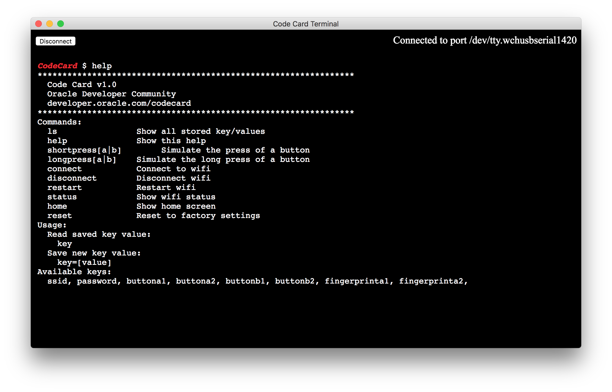

# Code Card Terminal

To make it easier to connect to your Code Card, we created a custom Terminal App. This app is built with [Electron](https://electronjs.org/) so it is cross-platform.

The Code Card has a serial-usb chip. We use serial communication to configure the Code Card wifi and button settings.

## Download

We have pre-compiled version for [Windows](https://github.com/noelportugal/codecard/raw/master/terminal/codecard-terminal-win32-x64.zip), [Mac](https://github.com/noelportugal/codecard/raw/master/terminal/codecard-terminal-darwin-x64.zip), and [Linux](https://github.com/noelportugal/codecard/raw/master/terminal/codecard-terminal-linux-x64.zip).

If your machine is not recognizing the Code Card, you might need to install the [CH340 USB-Serial drivers](https://sparks.gogo.co.nz/ch340.html).

### Alternative
You can also use any terminal emulator app such as [PuTTY](https://www.putty.org/) (Windows), [CoolTerm](http://freeware.the-meiers.org/CoolTermMac.zip) (Mac), or [screen](https://linux.die.net/man/1/screen) (Mac and Linux.)

The USB-Serial port will have different names depending on your OS:
-	Windows: COM[X]
-	Mac: /dev/tty.wchusbserial[XXXX]
-	Linux: /dev/ttyUSB[X]

##### Steps

1. Connect to the device with the emulator for your OS (baud rate = 115200)
2. Once connected, you'll need to reset the device by flipping the power switch off then on again
3. Type help in the emulator to bring up a list of commands

To change to wifi profile

	ssid={your-ssid}
	password={your-wifi-password}

Keep in mind that pausing for 2 seconds while typing will automatically enter the command. It may be easier to pre-type the commands elsewhere and copy-paste them into the window.

### Manual Installation

First [download](https://github.com/noelportugal/codecard.git) or clone (`git clone https://github.com/noelportugal/codecard.git`) this repository.

You must have NodeJs installed. We recommend using [nvm](https://github.com/creationix/nvm) to manage different versions.

	cd terminal
	npm install
	npm run start

Follow OS build specific instructions [here](https://electronjs.org/docs/development).
* For Windows you must install using the following flags:
	`npm install --global --production windows-build-tools`

### Compile
If you want to compile the Electron app use [electron-packager](https://github.com/electron-userland/electron-packager). Make sure you are in the terminal directory.
	
	npm install electron-packager -g
	electron-packager . codecard-terminal
